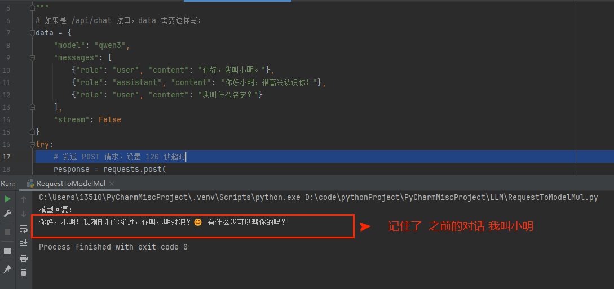

# SimplePython
#### 问题1:http://127.0.0.1:11434/api/chat与http://127.0.0.1:11434/api/generate有什么区别
> 这两个 API 端点都是 Ollama 提供的核心接口，它们最根本的区别在于是否支持多轮对话的上下文记忆
> /api/chat 是专门为聊天对话设计的，能记住你们之前聊过的内容；而 /api/generate 则是用于单次文本生成，每次提问都是全新的、独立的。
> 你需要把之前的对话历史（包括用户的提问和 AI 的回答）一起发给模型
> /api/chat
```json
{
  "model": "qwen",
  "messages": [
    {"role": "user", "content": "你好，我叫小明。"},
    {"role": "assistant", "content": "你好小明，很高兴认识你！"},
    {"role": "user", "content": "我叫什么名字？"} 
  ]
}
```

> /api/generate(纯文本生成)
```json
{
  "model": "qwen",
  "prompt": "请写一首关于春天的五言绝句。"
}
```
---
#### 问题2:利用openAI的库 去代码访问ollama本地qwen模型
#### 问题3:message消息中的role有什么作用
role=xxx 是构建对话上下文的两个核心[角色标签] 它们共同决定了模型如何理解任务、生成回复以及维持对话逻辑
> 消息内容
```json
{
  "model": "qwen",
  "messages": [
    {"role": "user", "content": "你好，我叫小明。"},
    {"role": "assistant", "content": "你好小明，很高兴认识你！"},
    {"role": "user", "content": "我叫什么名字？"} 
  ]
}
```
- role=system 定义模型的“人设”与行为准则
```java
// 作用：这是对话的“最高指令”，用于设定模型的身份、语气、专业领域、输出格式或行为边界。它通常在消息列表的最开始位置出现，对整个会话具有全局性、持久性的影响。
// 示例：{'role': 'system', 'content': '你是一个乐于助人的AI助手。'} 这句话告诉模型：“你的身份是助手，目标是帮助用户，语气要友好。”
// 重要性：没有 system 角色，模型可能无法准确把握用户意图，容易生成不符合预期的回复（如过于学术化、口语化或不相关）。它是控制模型输出风格和安全性的关键。
```
- role=user 代表真实用户的输入与请求
```java
// 作用：这是对话的“触发器”，用于传递用户的具体问题、指令或信息。模型会根据 user 的内容，结合 system 设定的规则，生成相应的回复。
// 示例：{'role': 'user', 'content': '请用Python写一个快速排序函数。'} 这句话是用户向模型发出的具体任务请求。
// 重要性：user 角色是对话的核心驱动力，没有它，模型就没有响应对象。在多轮对话中，每一次用户的新提问都应标记为 user，以维持上下文连贯性。
```
- role=assistant 用于记录模型之前生成的回复，帮助模型“记住”自己说过什么，从而实现多轮对话的记忆功能
```java
// 大模型本身是“无状态”的，它并没有真正的记忆功能。为了让模型知道之前聊了什么，你需要把历史的问答打包发给它。
// 工作原理：每次用户提出新问题（user），你都需要将之前的提问（user）和模型曾经的回答（assistant）一并放入 messages 列表中传给接口。
// 示例:
messages=[
    {'role': 'system', 'content': '你是一个乐于助人的AI助手。'},
    {'role': 'user', 'content': '请用Python写一个快速排序函数。'},
    {'role': 'assistant', 'content': '好的，这是快速排序的代码...'}, # 模型上次的回复
    {'role': 'user', 'content': '请帮我加上详细的中文注释。'}       # 用户的追问
]
```
#### 问题4:温度(temperature)参数
> 什么是温度(temperature)参数
```java
// temperature 是控制模型输出随机性和创造性的全局生成参数 控制创造性，值越高越有创意，越低越严谨
// 1.正确使用 temperature 参数：
    // 1.1 temperature 的取值通常在 0 到 2 之间。
    // 1.2 低温度（如 0.1 - 0.3）：输出更确定、保守。适合写代码、总结事实等需要严谨性的任务。
    // 1.3 高温度（如 0.7 - 0.9）：输出更随机、有创意。适合写故事、头脑风暴或创意文案。
```

#### 问题5:大模型如何进行工具调用(Function Calling-函数调用)
> 背景
```java
// 大模型本身不会直接执行代码或访问数据库
// 用户提出的问题 --- > LLM ---- > 生成结构化的 JSON（包含要调用的函数名和参数）
---> 真正执行由Agent调度执行 --- > 执行结果 ---- > LLM --- > 生成自然语言回答
```
> 准备工作
```java
1.定义本地工具函数 (真正干活的"工人") 真正的执行部分 
2.工具映射表，方便后续通过名称查找并执行对应的函数
3.注册工具到模型 (告诉模型有哪些工具可用)
```
> 整体流程

```java
1.第一次调用 让[模型]决定是否调用工具
2.如果调用工具 能从返回中拿到
  2.1 函数名
  2.2 参数
3.Python调用相关的工具函数 得到结果 A
4.将工具函数结果A 追加到[对话上下文中] 进行LLM模型的 第二次调用 返回真实的自然语言回答
```
> 第一次调用 结果报文如下:
```json
{
	"id": "chatcmpl-093a24a9-d6c6-972f-9850-497d5a057455",
	"choices": [
		{
			"finish_reason": "tool_calls",
			"index": 0,
			"logprobs": null,
			"message": {
				"content": "",
				"refusal": null,
				"role": "assistant",
				"annotations": null,
				"audio": null,
				"function_call": null,
				"tool_calls": [
					{
						"id": "call_f44af32690b74b9d96e54f",
						"function": {
							"arguments": "{\"location\": \"杭州\"}",
							"name": "get_current_weather"
						},
						"type": "function",
						"index": 0
					}
				]
			}
		}
	],
	"created": 1781022105,
	"model": "qwen-max",
	"object": "chat.completion",
	"service_tier": null,
	"system_fingerprint": null,
	"usage": {
		"completion_tokens": 18,
		"prompt_tokens": 265,
		"total_tokens": 283,
		"completion_tokens_details": null,
		"prompt_tokens_details": {
			"audio_tokens": null,
			"cached_tokens": 256
		}
	}
}
```

#### 问题6:分词
> Token ID 是模型词汇表中每个词元（Token）的唯一数字编号。模型无法直接理解文字，它只能处理数字。因此，所有输入文本都必须先被分词器转换为一系列 Token ID，然后才能送入模型进行计算。
> Qwen 模型的分词器采用了 BPE 算法，它会优先匹配词汇表中频率最高的词组。由于“喜欢你”是一个非常常见的中文短语，它很可能作为一个整体被收录在词表中，因此只占用一个 Token ID。而“我”作为独立的高频字，也拥有自己的独立 ID。这就是为什么“我喜欢你”总共只占用了 2 个 Token。
```python
# 【可选】如果你想看看具体被切分成了哪些 token，可以打印详情：
# text = "我喜欢你"
tokens = tokenizer.tokenize(text)
token_ids = tokenizer.encode(text)
print(f"Token 切分结果: {tokens}") # Token 切分结果: ['我', '喜欢你']
print(f"对应的 Token ID: {token_ids}") # 对应的 Token ID: [109366, 56568]
```


